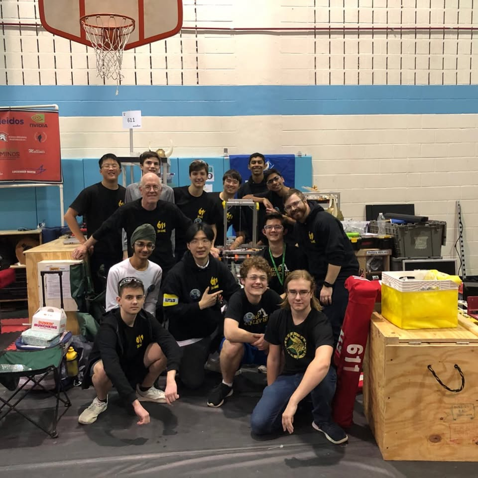

# FRC Team 611 – Mechanical Engineering

> Mechanical engineering experience gained as a member of **FIRST Robotics Competition (FRC) Team 611 (Saxons)** at Langley High School in McLean, Virginia.

Mechanical engineering experience gained through building, testing, integrating, and maintaining competition robots for the **FIRST Robotics Competition (FRC)**. My responsibilities focused on the mechanical subsystem, robot assembly, testing, troubleshooting, and competition support while working as part of a multidisciplinary engineering team.

## Project Gallery

### Team 611


### FIRST Chesapeake District Event



### 2020 District Finalist Award


---

## Overview

FIRST Robotics Competition (FRC) is an international robotics competition where student teams design, manufacture, assemble, program, and compete with industrial-scale robots under strict engineering deadlines.

As a member of **FRC Team 611 (Saxons)**, I gained practical experience in mechanical engineering through robot assembly, subsystem integration, testing, maintenance, and competition preparation. Team 611 is based at Langley High School in McLean, Virginia and has competed since 2001. :contentReference[oaicite:0]{index=0}


---

## My Responsibilities

As a mechanical team member, I contributed to:

- Mechanical assembly of competition robots
- Integration of mechanical subsystems
- Robot testing and validation
- Troubleshooting mechanical issues
- Maintenance and repairs during competitions
- Competition pit support
- Collaboration with electrical and software subteams

---

## Skills Demonstrated

- Mechanical Assembly
- Robot Integration
- Hardware Testing
- Troubleshooting
- Rapid Prototyping
- Team Collaboration
- Engineering Documentation
- Competition Support

---

## Competition Experience

### FIRST Chesapeake District Events

Team 611 successfully competed in multiple FIRST Chesapeake District competitions.

Highlights include:

- FIRST Chesapeake District Finalist (2020)
- District competition participation
- Robot inspection and field testing
- Match preparation and pit support
- Mechanical troubleshooting under time constraints

---

## Team Photos

### Competition Team


### Team in the Pit


### FIRST Chesapeake District Finalist Award


---

## Engineering Experience

Working on Team 611 strengthened practical engineering skills including:

- Mechanical system assembly
- Manufacturing processes
- Precision fitting
- Hardware validation
- Collaborative engineering
- Design iteration under deadlines
- Competition readiness

---

## Technologies

- FIRST Robotics Competition
- Mechanical Design
- Hand Tools
- Power Tools
- CAD Review
- Mechanical Integration
- Robot Assembly
- Testing & Validation

---

## Repository Structure

```
FRC-Team-611-Robotics/
│
├── images/
│   ├── team-photo.png
│   ├── pit-team.jpg
│   └── award-2020-finalist.png
│
└── README.md
```

---

## About Team 611

FIRST Robotics Competition Team 611 (Saxon Robotics) is based at Langley High School in McLean, Virginia.

The team designs, builds, and competes with industrial-scale robots while giving students hands-on engineering experience in mechanical design, electrical systems, programming, manufacturing, and project management.
